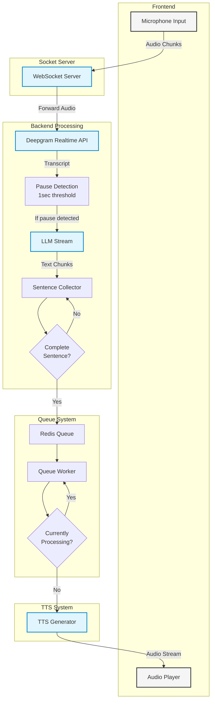
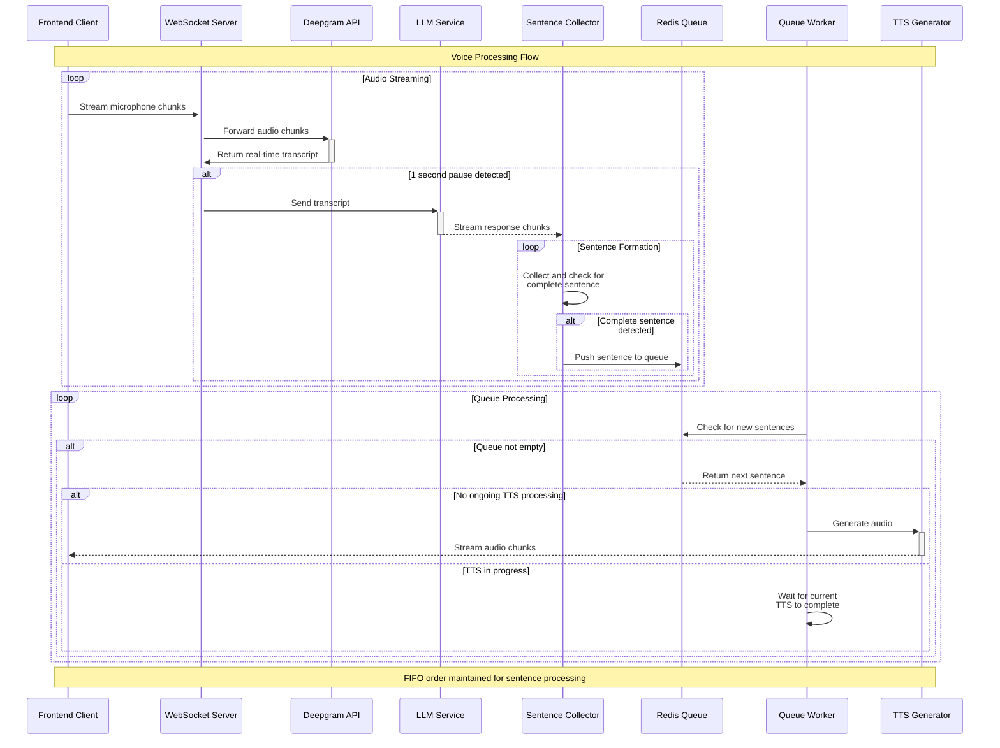

# Voice Agent 

A real-time voice-to-voice conversation system that enables natural, fluid interactions with AI. This system processes human speech, understands context, and responds with natural-sounding voice, all in real-time.


## ✨ Features
1. **Event-Driven**: The architecture revolves around the events of receiving audio chunks, processing them, and responding in real-time.
2. **Real-Time**: It is designed to minimize latency, ensuring conversational interactions.
3. **Audio Processing**: Handles audio streams, transcription, LLM responses, and TTS generation efficiently.
4. **Redis Queue Integration**: Utilizes Redis queues for user-specific message handling, ensuring organized processing of transcriptions and responses. Each user gets their dedicated queue, preventing message mixing across different conversations.
5. **FIFO Processing**: Maintains strict First-In-First-Out order for each user's responses, ensuring conversational coherence and natural dialogue flow.
6. **Stateful Processing**: Redis queues maintain conversation state and message order per user, allowing for context-aware responses and proper sentence sequencing during TTS generation.
7. **Lightweight**: Redis's in-memory nature provides extremely low latency for queue operations while maintaining message persistence.
8. **User Isolation**: Dedicated queues per user ensure that concurrent conversations remain isolated and don't interfere with each other's processing flow.
9. **Sentence-Level Processing:** Smart sentence boundary detection for natural speech synthesis

## 🛠️ Built With
- [FastAPI](https://fastapi.tiangolo.com/)
- [Socket.IO](https://socket.io/)
- [OpenAI](https://openai.com/)
- [Groq](https://groq.com/)
- [Deepgram](https://deepgram.com/)
- [React.js](https://react.dev/)


## 🚀 Getting Started

### Prerequisites

- Python 3.9+
- API keys for:
  - OpenAI
  - Groq 
  - Deepgram 

### Installation

1. Clone the repository:
```bash
git clone https://github.com/yourusername/voice-agent.git
cd voice-agent
```

2. Create and activate virtual environment:
```bash
python -m venv venv
source venv/bin/activate  # On Windows: venv\Scripts\activate
```

3. Install dependencies:
```bash
pip install -r requirements.txt
```

4. Create `.env` file:
```env
OPENAI_API_KEY=your_openai_key
GROQ_API_KEY=your_groq_key
DEEPGRAM_API_KEY=your_deepgram_key
REDIS_HOST="localhost"
REDIS_PORT="6379"
```

### Running the Application

1. Start the server:
```bash
uvicorn main:app --reload
```

2. The API will be available at:
- WebSocket: `ws://localhost:8000/ws`
- REST API: `http://localhost:8000/`

3. Start frontend:
```bash
cd frontend
npm run dev
```

4. The UI will be available at:
- `http://127.0.0.1:5173/`

## System Architecture

### Flow Diagram


### Sequence Diagram


## Component Description

### Frontend
- Handles microphone input capture
- Streams audio chunks to WebSocket server
- Plays received audio responses

### Socket Server
- Manages WebSocket connections
- Routes audio chunks to Deepgram API
- Handles real-time communication

### Backend Processing
- Integrates with Deepgram for real-time transcription
- Implements 1-second pause detection
- Processes transcripts through LLM
- Collects and validates complete sentences

### Queue System
- Redis-based FIFO queue
- Ensures ordered processing of responses
- Manages TTS processing states

### TTS System
- Generates audio from text responses
- Streams audio chunks back to frontend
- Maintains sequential processing

<!-- ## 📡 WebSocket Events

### Client to Server

 TODO - ADD

### Server to Client

 TODO - ADD -->


## ⚠️ Known Issues

- Nested websocket (Deepgram) can cause scalability issue
- Socket connection rate limit can cause issue in sclale

## 🤝 Contributing

1. Fork the repository
2. Create a feature branch: `git checkout -b feature-name`
3. Commit changes: `git commit -am 'Add feature'`
4. Push to branch: `git push origin feature-name`
5. Submit a Pull Request

## 📄 License

This project is licensed under the MIT License - see the [LICENSE](LICENSE) file for details.

## 🙏 Acknowledgments

- Credit to libraries and services used
- Community contributions

## 📞 Contact

Linkedin - [@Spandan Joshi](www.linkedin.com/in/spandan-joshi-39ba94171)
Project Link: [https://github.com/spandan114/AI-realtime-voice-agent](https://github.com/spandan114/AI-realtime-voice-agent)

